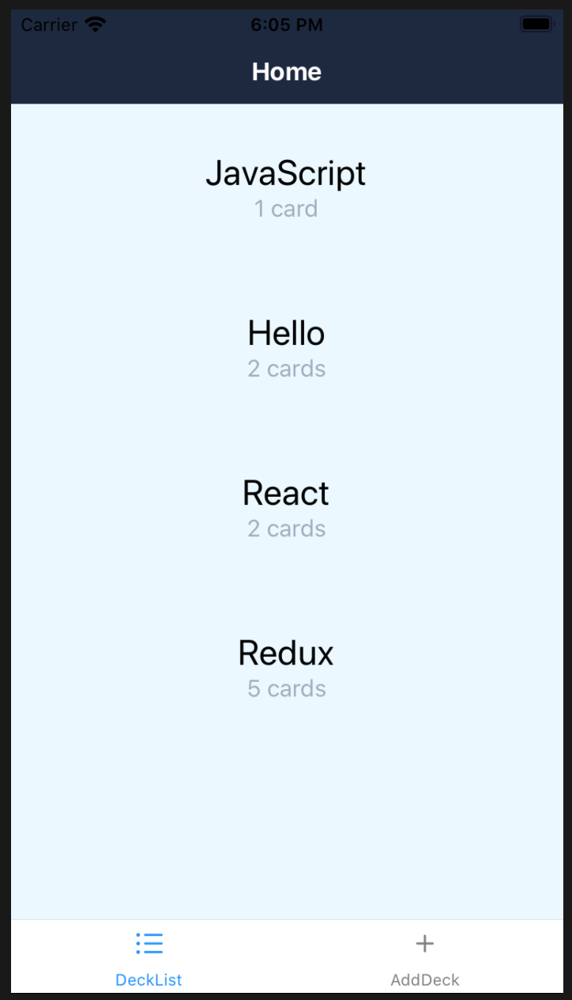
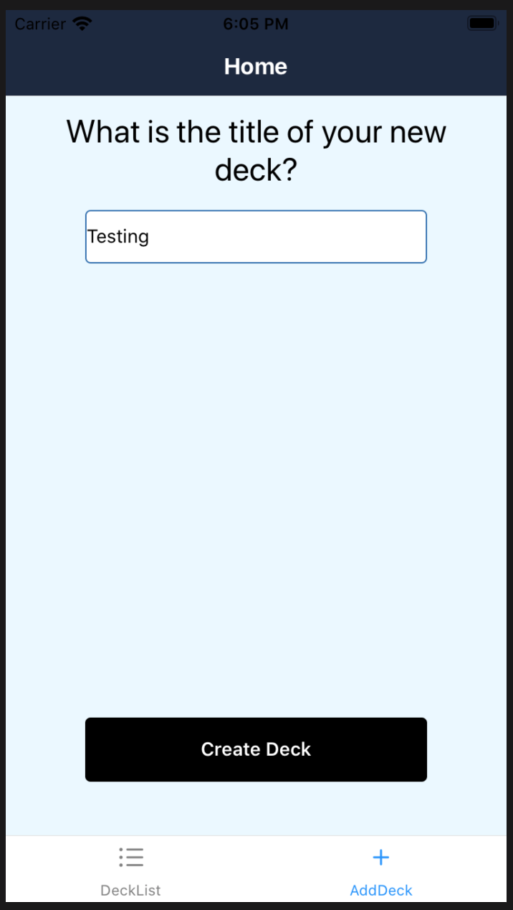
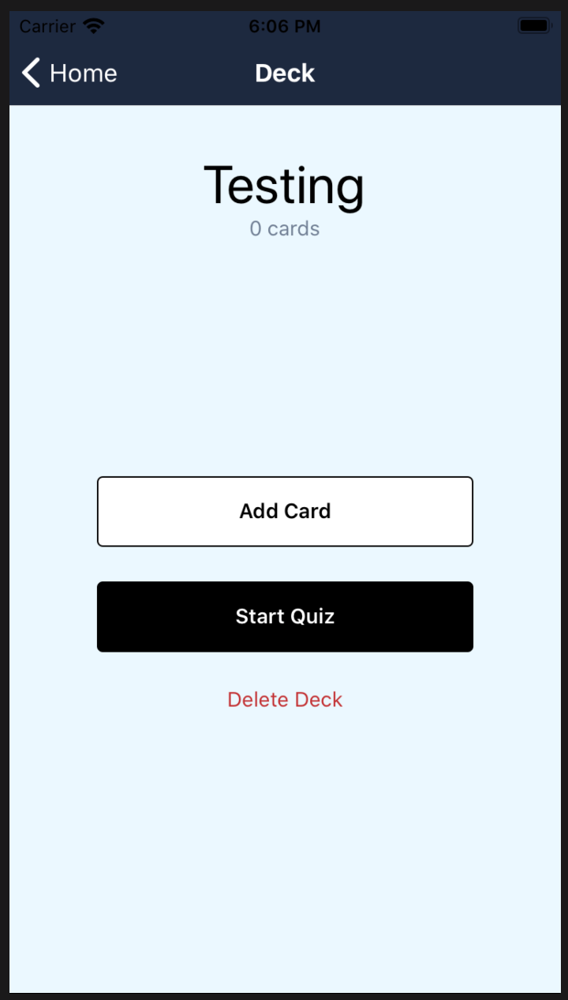
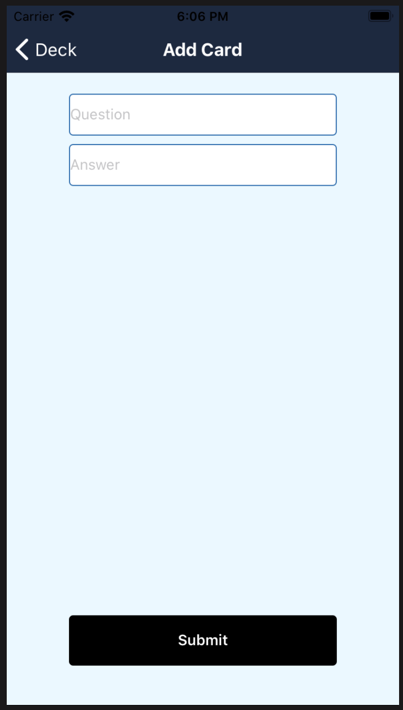
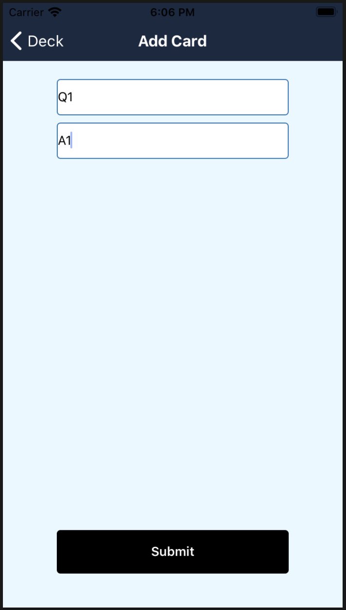
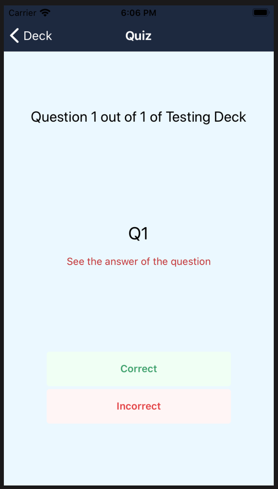
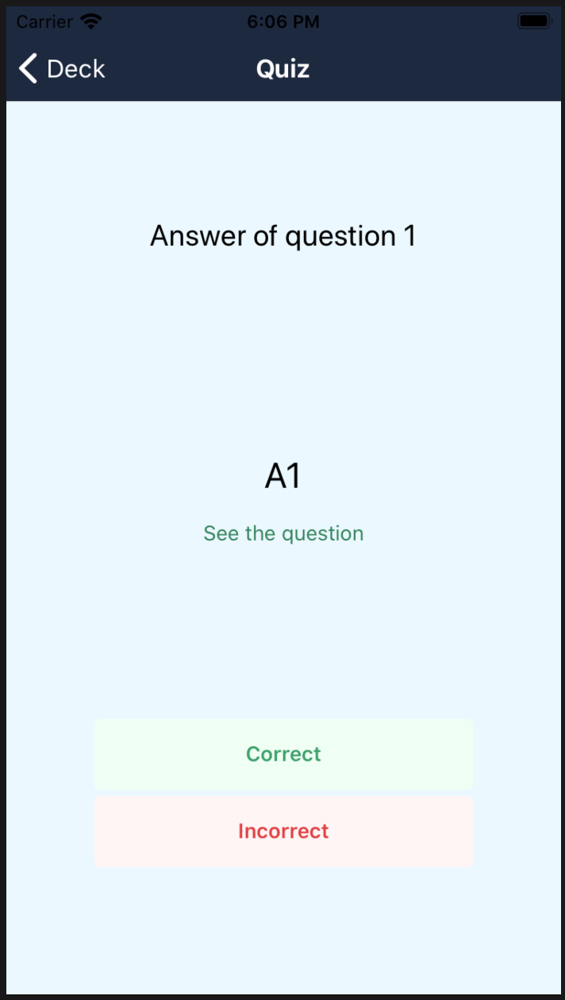
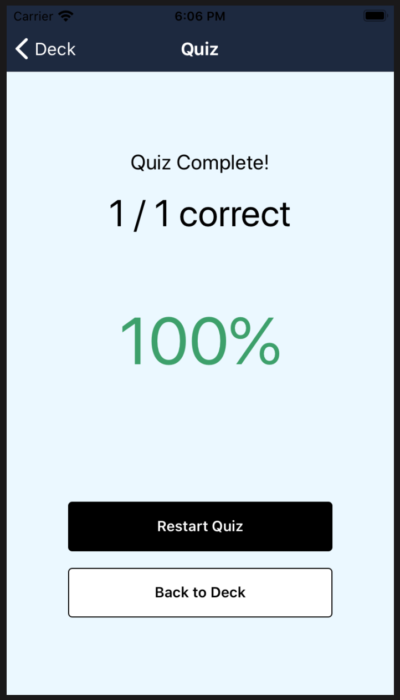
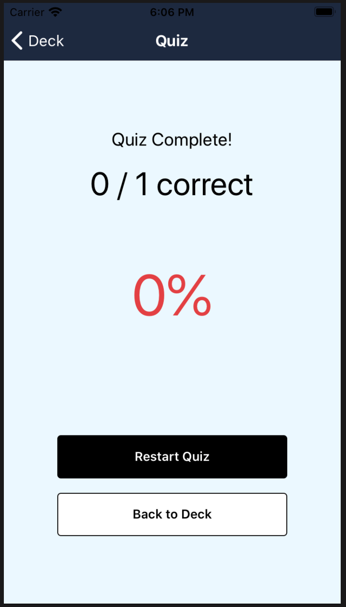

# Mobile Flashcards

Mobile Flashcards is a mobile application (Android or iOS - or both) that allows users to study collections of flashcards. The app allows users to create different categories of flashcards called "decks", add flashcards to those decks, then take quizzes on those decks.

Chek out the demo: https://snack.expo.io/@gonxis/mobile-flashcards

## 🚀 How to use

- Install with `yarn`. `npm install` or `npm i` is giving error in my project, please, install with yarn instead.
- Run `expo start` to try it out.

### Scripts

- `yarn start`: runs the app in development mode
- `yarn run ios`: builds the app for iOS
- `yarn run test`: runs the test watcher in an interactive mode
- `yarn run eject`: ejects the app so you have full control over configuration files and transitive dependencies

## Create React Native App

This project was bootstrapped with [Create React Native App](https://github.com/react-community/create-react-native-app).

Below you'll find information about performing common tasks. The most recent version of this guide is available [here](https://github.com/react-community/create-react-native-app/blob/master/react-native-scripts/template/README.md).

## Built With

* [React](https://reactjs.org/) - A JavaScript library for building user interfaces
* [React Native](https://facebook.github.io/react-native/) - A framework for building native apps using React
* [expo](https://expo.io/) - A toolchain built around React Native to help us build native apps using JavaScript and React
* [React Navigation](https://reactnavigation.org/) - Routing and navigation for your React Native apps
* [Redux](https://redux.js.org/) - Redux is a predictable state container for JavaScript apps
* [react-redux](https://github.com/reactjs/react-redux) - Official React bindings for Redux

## 📝 Tailwind CSS in use at mobile-flashcards project

- I am using the [`tailwind-rn`](https://github.com/vadimdemedes/tailwind-rn) library to learn how to use it and giving React Native project a different styling type.
- [Tailwind CSS Documentation](https://tailwindcss.com/docs/utility-first).

## Contributing

You are always welcome to contribute with the project.

## Testing

Tested in: 
* iOS Simulator (iPhone SE 2nd Generation)
* Android Pie (Samsung Galaxy S8)

## ScreenShots

